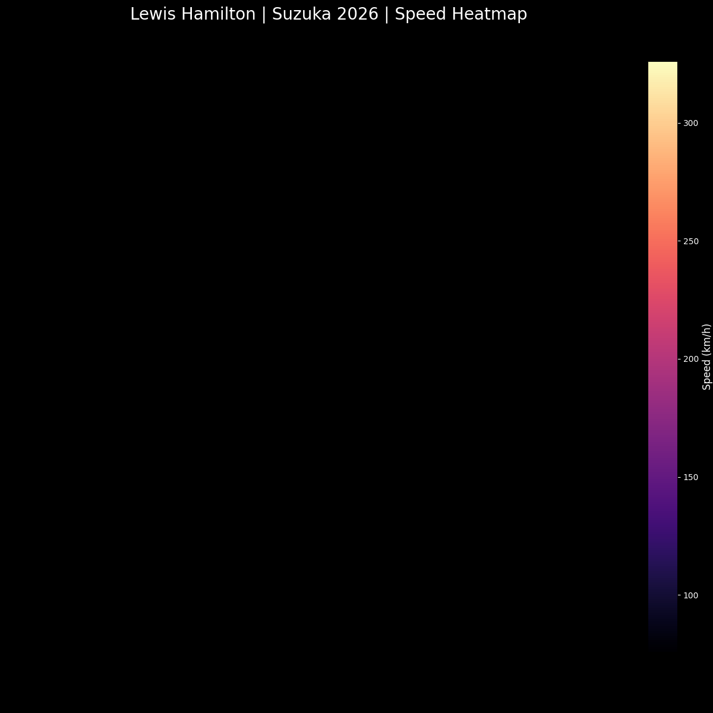

<div align="center">

# 🏎️ F1 Tyre Strategy Predictor: The Hamilton-Ferrari Era
### *Real-Time Machine Learning Analysis for the 2026 Chinese GP*


<p align="center">
  
  
## 🗺️ Visual Telemetry: Suzuka Speed Map

*This heatmap visualizes LH44's speed across the Suzuka International Racing Course. Darker regions indicate heavy braking zones, while bright yellow highlights high-speed sections like the 130R.*

</p>

---

## 📊 Live Comparative Analysis


*“In F1, speed is a given. Strategy is the variable.”*

---
</div>

## 🧠 Project Overview
As a 3rd-year B.Tech AI student at Gautam Buddha University, I developed this tool to decode the "Tyre Cliff." By leveraging the **FastF1 API** and **Scikit-Learn**, this project analyzes Lewis Hamilton's performance as he transitions into the 2026 Ferrari era.

### 🎯 Key Features
- **Multi-Compound Modeling:** Compares degradation rates between **Soft (Red)** and **Medium (Yellow)** compounds.
- **Cross-Era Benchmarking:** Analyzes 2024 Mercedes telemetry against live 2026 Ferrari FP1 data.
- **Noise Reduction:** Implemented a 107% lap-time filter to eliminate "dirty air" and pit-sequence outliers.

## 🛠️ Tech Stack
- **AI/ML:** Linear Regression (Scikit-Learn)
- **Data:** FastF1 API, Pandas, NumPy
- **Visuals:** Matplotlib (Custom F1 Theme)
- **Version Control:** Git/GitHub

## 🏁 Strategy Insights
| Compound | Initial Pace | Degradation Slope | Stint Potential |
| :--- | :--- | :--- | :--- |
| **Soft (C4)** | High Grip | Steeper (+0.12s/lap) | Aggressive / Short |
| **Medium (C3)** | Balanced | Moderate (+0.05s/lap) | Optimal Race Pace |

---

<details>
<summary><b>📂 Technical Implementation Details</b></summary>

### Data Pipeline:
1. **Cache Management:** Uses `fastf1.Cache` to minimize API calls.
2. **Feature Engineering:** Extracts `TyreLife` and `LapTime` (converted to total seconds).
3. **Linear Fit:** Calculates the coefficient of degradation to predict "the cliff."

### How to Run:
```bash
git clone [https://github.com/vanshdeep2402/f1-tyre-management-ml.git](https://github.com/vanshdeep2402/f1-tyre-management-ml.git)
pip install fastf1 scikit-learn matplotlib pandas
python china_gp_ml.py

