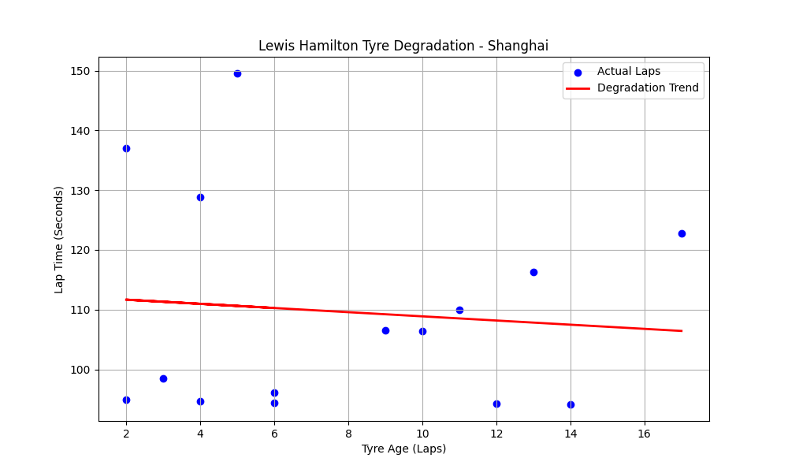

# 🏎️ Live F1 Tyre Management Predictor: 2026 Chinese GP
> **Status:** Live Analysis (FP1 Completed - March 13, 2026)

This project uses Machine Learning (Linear Regression) to analyze **Lewis Hamilton's** tyre degradation in real-time. By comparing 2024 historical data with live 2026 telemetry, this tool predicts the "performance drop-off" for the Ferrari SF-26.

## 📊 Live Visualization

## 🎯 Project Objectives
- **Predictive Strategy:** Estimate lap-time loss per lap of tyre age.
- **Cross-Era Comparison:** Analyzing Hamilton's Mercedes (2024) vs. Ferrari (2026) tyre management.
- **Data Pipeline:** Automated cleaning of live Practice (FP1) data using a 107% lap-time filter.

## 🛠️ Tech Stack
- **Languages:** Python 3.14
- **Libraries:** FastF1 (Telemetry), Scikit-Learn (ML), Matplotlib (Charts), Pandas
- **Version Control:** Git

## 🚀 How to Run Locally
1. Clone the repo: `git clone https://github.com/YOUR_USERNAME/f1-tyre-management-ml.git`
2. Install dependencies: `pip install fastf1 scikit-learn matplotlib pandas`
3. Run the analysis: `python china_gp_ml.py`

## 🧠 Model Logic
The model uses **Linear Regression** to fit a trend line over noisy practice data. Practice sessions are notoriously difficult to analyze due to traffic and fuel-load testing; this script implements custom filtering to focus only on "push" laps.